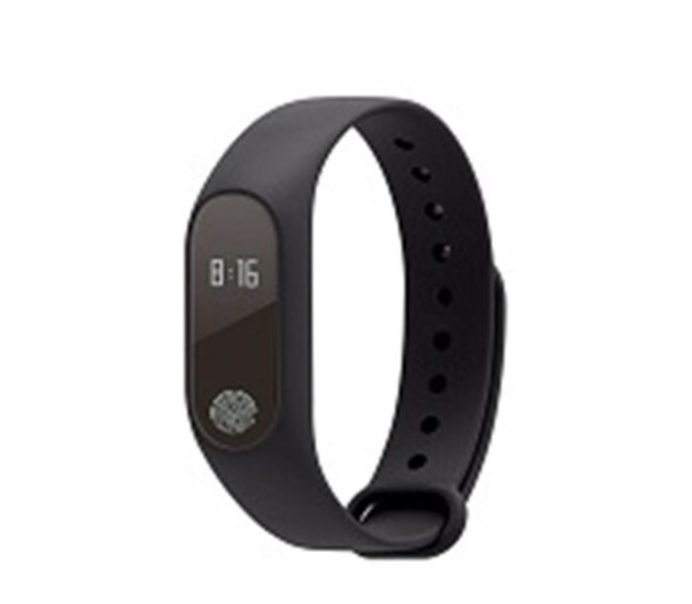

# 作業二－電商前端應用
<!DOCTYPE html>
<html lang="zh-TW">

<head>
    <meta charset="UTF-8">
    <meta name="viewport" content="width=device-width, initial-scale=1.0">
    <meta http-equiv="X-UA-Compatible" content="ie=edge">
    <title>作業二 - 電商前端應用</title>

 
    <link rel="stylesheet" href="https://stackpath.bootstrapcdn.com/bootstrap/4.3.1/css/bootstrap.min.css" integrity="sha384-ggOyR0iXCbMQv3Xipma34MD+dH/1fQ784/j6cY/iJTQUOhcWr7x9JvoRxT2MZw1T" crossorigin="anonymous">
    <link rel="stylesheet" href="/index.css">
</head>

<body>

    

        

            <h1>作業二 - 電商前端應用</h1>
        

        <!-- 工具列 -->
        

            

                <button id="query" type="button" class="btn btn-primary">查詢</button>
            

        

        

            

                <button id="query" type="button" class="btn btn-primary">新增</button>
                <li href="file:///Users/tingchen/Desktop/%E4%BD%9C%E6%A5%AD2/%E6%96%B0%E5%A2%9E/index.html"></li>
            

        

        <!-- 產品列表 -->

        

            

                

                    
                    <h5>路由器</h5>
                    <h7>NT$727</h7>
                

                

                    
                    <h5>小米手環</h5>
                    <h7>NT$325</h7>
                

                

                    
                    <h5>小米行動電源</h5>
                    <h7>NT$699</h7>
                

            

        

        

            

                

                    
                    <h5>小米行動電源</h5>
                    <h7>NT$699</h7>
                

                

                    
                    <h5>小米手環</h5>
                    <h7>NT$325</h7>
                

                

                    
                    <h5>路由器</h5>
                    <h7>NT$727</h7>
                

            

        

        

            

                

                    
                    <h5>小米行動電源</h5>
                    <h7>NT$699</h7>
                

                

                    
                    <h5>路由器</h5>
                    <h7>NT$727</h7>
                

                

                    
                    <h5>小米手環</h5>
                    <h7>NT$711</h7>
                

            

        

        

            

                

                    
                    <h5>路由器</h5>
                    <h7>NT$727</h7>
                

                

                    
                    <h5>小米手環</h5>
                    <h7>NT$325</h7>
                

                

                    
                    <h5>小米行動電源</h5>
                    <h7>NT$699</h7>
                

            

        

        <!-- 分頁 -->
        

            

                <nav aria-label="Page navigation example">
                    <ul id="page-number" class="pagination justify-content-center">
                        <li class="page-item disabled">
                            <a class="page-link" href="#" tabindex="-1" aria-disabled="true">&laquo;</a>
                        </li>
                        <li class="page-item active"><a class="page-link" href="#">1</a></li>
                        <li class="page-item"><a class="page-link" href="file:///Users/tingchen/Desktop/作業2/第二頁/index.html">2</a></li>
                        <li class="page-item"><a class="page-link" href="file:///Users/tingchen/Desktop/%E4%BD%9C%E6%A5%AD2/%E7%AC%AC%E4%B8%89%E9%A0%81/index.html">3</a></li>
                        <li class="page-item">
                            <a class="page-link" href="#">&raquo;</a>
                        </li>
                    </ul>
                </nav>
            

        

        <!-- 頁尾 -->
        <footer>
            

                2019 &copy; 前端程式設計
            

        </footer>
    

    

        

            

                

                    <h5 class="modal-title">系統訊息</h5>
                    <button type="button" class="close" data-dismiss="modal" aria-label="Close">
                &times;
              </button>
                

                

                    
要顯示的訊息

                

                

                    <button type="button" class="btn btn-secondary" data-dismiss="modal">關閉</button>
                

            

        

    

    
    <!--  -->
    
    

    
</body>

</html>
